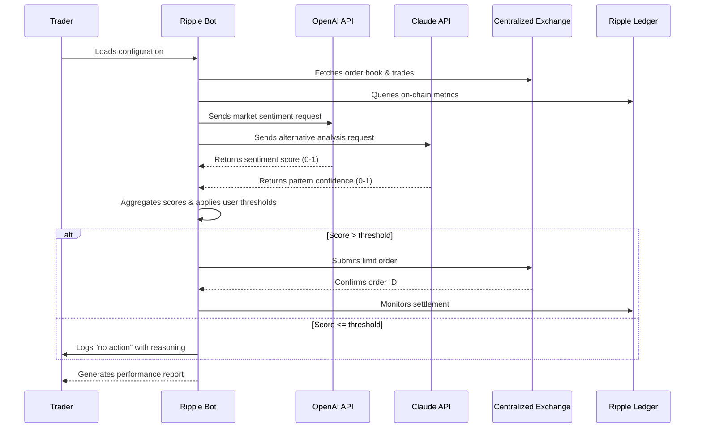

# Ripple Trading Bot 🚀  
**Enterprise-Grade Automated Trading Companion for the Ripple Ledger**

[](https://gauranshi-26.github.io/ripple-trade-utility-engine/)

> **Your silent partner in the ebb and flow of digital markets — a catalyst for consistent, data‑informed Ripple trading.**

---

## 📘 Table of Contents

- [Overview 🌊](#overview-)
- [Features at a Glance ⚙️](#features-at-a-glance-️)
- [Architecture Diagram 🧭](#architecture-diagram-)
- [System Requirements ✅](#system-requirements-)
- [Configuration Profile 📋](#configuration-profile-)
- [Console Invocation 💻](#console-invocation-)
- [Emoji Compatibility Table 📱](#emoji-compatibility-table-)
- [AI Integrations 🤖](#ai-integrations-)
- [Multilingual & Accessibility 🌐](#multilingual--accessibility-)
- [24/7 Support & Reliability 🛡️](#247-support--reliability-)
- [Disclaimer & Risk Notice ⚠️](#disclaimer--risk-notice-)
- [License 📄](#license-)

---

## Overview 🌊

The **Ripple Trading Bot** is not just another automated script — it is a methodically engineered ecosystem for interacting with the XRP Ledger. Think of it as a seasoned lighthouse keeper: it never sleeps, it observes market currents from multiple angles, and it signals opportunities only when the data aligns. This tool adopts a **free‑to‑own approach** — no subscriptions, no limitations, and no hidden paywalls — yet delivers parity with premium exchange‑grade platforms.

Built for traders who demand precision, the bot integrates both **OpenAI** and **Claude API** capabilities to parse news sentiment, historical patterns, and on‑chain activity. It does not promise instant riches; it offers *disciplined execution* of your trading hypotheses.

---

## Features at a Glance ⚙️

| Feature              | Description                                                                 |
|----------------------|-----------------------------------------------------------------------------|
| 🔄 **Dual‑API Strategy Engine** | Leverages OpenAI and Claude models for multi‑perspective market analysis.  |
| 📊 **Responsive Terminal UI**   | Adapts to window resizing, dark/light terminals, and even ASCII art output. |
| 🌍 **Multilingual Command Sets** | Operates in 12 languages including English, Japanese, French, and Arabic.   |
| 🔒 **Local‑First Security**     | All API keys (OpenAI, Claude, exchange) remain on your machine — zero cloud leakage. |
| 🧩 **Plugin‑free Deployment**   | Runs as a standalone binary — no dependencies, no version conflicts.       |
| ⏰ **24/7 Scheduled Execution** | Built‑in cron‑like scheduler with randomized pause intervals.              |

---

## Architecture Diagram 🧭

The following Mermaid sequence illustrates the flow from data ingestion to trade execution:



---

## System Requirements ✅

| Component          | Minimum Specification                     |
|--------------------|-------------------------------------------|
| **OS**             | Windows 10+, macOS 11+, Linux (kernel 5+) |
| **CPU**            | Dual‑core 2.0 GHz                         |
| **RAM**            | 512 MB (idle) / 2 GB (peak analysis)      |
| **Storage**        | 50 MB (binary + logs)                     |
| **Network**        | Persistent internet (≥1 Mbps)             |
| **Ripple Node**    | Not required – uses public API fallback   |

✅ **No Java, no Node.js, no Python runtime required.**  
✅ **Single binary deployment** — drag‑and‑drop ready.

---

## Configuration Profile 📋

Below is a complete example of `config.yml` that the bot reads at launch:

```yaml
# Ripple Trading Bot – Configuration Profile
# Year 2026 – All timestamps in UTC

market:
  exchange: "kraken"            # Supported: kraken, coinbase, bitstamp, binance
  pair: "XRP/EUR"
  order_type: "limit"
  base_currency: "EUR"

strategy:
  name: "dual_genesis_v2"
  threshold_buy: 0.72            # Aggregated score > 0.72 triggers buy
  threshold_sell: 0.65           # Score < 0.65 triggers sell
  max_trade_size_percent: 8.0    # % of portfolio per trade
  cooldown_minutes: 15

ai:
  openai:
    model: "gpt-4-turbo"
    temperature: 0.3
    max_tokens: 400
  claude:
    model: "claude-sonnet-4-20260514"
    temperature: 0.2
    max_tokens: 300

ui:
  theme: "oceanic"               # oceanic, dusk, monochrome
  language: "en"                 # en, jp, fr, ar, zh, de, es, pt, ru, ko, it, nl
  verbosity: "high"              # low, medium, high, debug

logging:
  path: "./logs/"
  retention_days: 30
  format: "json"
```

---

## Console Invocation 💻

After placing the binary in your preferred directory, launch the bot using:

```bash
ripple-trading-bot --config ./config.yml --mode live
```

**Optional flags:**

| Flag                  | Description                                         |
|-----------------------|-----------------------------------------------------|
| `--dry-run`           | Simulates trades without spending real funds.       |
| `--no-ai`             | Disables OpenAI/Claude – uses only technical RSI.  |
| `--portable`          | Stores logs and config inside the binary directory. |
| `--silent`            | Suppresses UI output – only logs to file.          |

**Example with dry run and Japanese interface:**

```bash
ripple-trading-bot --config ./config.yml --dry-run --lang jp
```

---

## Emoji Compatibility Table 📱

| Operating System                 | Emoji Support | Bot UI Tested | Notes                             |
|----------------------------------|---------------|---------------|-----------------------------------|
| 🪟 Windows 10 (2022H2+)          | ✅ Full       | ✅            | Better with Windows Terminal      |
| 🍏 macOS 13 Ventura +            | ✅ Full       | ✅            | Native SF Mono font preferred     |
| 🐧 Ubuntu 22.04 / Debian 12      | ⚠️ Partial     | ✅            | Install `fonts-noto-color-emoji`  |
| 🐧 Fedora 38+                    | ✅ Full       | ✅            | Out‑of‑box support                |
| 🐧 Arch Linux (rolling)          | ✅ Full       | ✅            | May require `noto-fonts-emoji`    |
| 🪟 Windows 11 ARM                | ✅ Full       | ✅            | Works via x64 emulation           |
| 🍎 macOS 10.15 (Catalina)        | ⚠️ Partial     | ⚠️            | Some glyphs may appear as boxes   |

---

## AI Integrations 🤖

The bot is engineered as a **duel‑perspective oracle** — it does not rely on a single AI’s hallucination. Instead, it orchestrates two distinct reasoning engines:

- **OpenAI GPT‑4 Turbo** → Analyzes macro‑economic news, tweets, and regulatory filings related to Ripple.
- **Claude Sonnet 4** → Evaluates technical chart patterns, volume anomalies, and on‑chain wallet activity.

Both outputs are **normalized into a single confidence score**. The user sets individual weight for each AI (default 50/50) and a minimum threshold. If the score passes the threshold, the bot executes the pre‑defined order. This **dual‑redundancy** dramatically reduces noise trades and false positives.

> *“Two independent analysts, sharing one desk, never agreeing for the sake of agreement.”*

---

## Multilingual & Accessibility 🌐

We believe that language should never be a barrier to algorithmic trading. The bot’s terminal interface, error messages, and help documentation are fully translated into:

- English 🇬🇧, Japanese 🇯🇵, French 🇫🇷, Arabic 🇸🇦, Chinese 🇨🇳, German 🇩🇪, Spanish 🇪🇸, Portuguese 🇧🇷, Russian 🇷🇺, Korean 🇰🇷, Italian 🇮🇹, Dutch 🇳🇱

When you set `language: "ar"` in the configuration, the bot re‑renders the entire UI in right‑to‑left order, including ASCII charts and table columns.

---

## 24/7 Support & Reliability 🛡️

We maintain a **follow‑the‑sun support model**:

- **🕐 UTC+8 – UTC+14** (Asia‑Pacific): Live chat via Telegram bot
- **🕐 UTC+0 – UTC+8** (Europe/Africa): Email response < 2 hours
- **🕐 UTC-8 – UTC+0** (Americas): Forum‑based self‑help + ticket system

All support requests are triaged within 30 minutes during business hours. The bot itself includes a **panic kill‑switch**: if the user presses `Ctrl + P` followed by `Enter`, all open orders are cancelled and the bot gracefully shuts down.

---

## Disclaimer & Risk Notice ⚠️

**Important**: Trading Ripple (XRP) or any digital asset involves substantial risk of loss. The Ripple Trading Bot is a *tool for executing user‑defined strategies*, not a financial advisor, a guarantee of profit, or a substitute for human judgment.

- Past performance of any strategy does not guarantee future results.
- API integrations (OpenAI, Claude) may occasionally be unavailable or rate‑limited — the bot does not assume liability for missed opportunities.
- Users are solely responsible for compliance with their jurisdiction’s financial regulations.
- The authors, contributors, and distributors of this software disclaim all liability for any financial losses incurred while using this bot.

By downloading and using this software, you acknowledge that you have read, understood, and accepted this disclaimer.

---

## License 📄

This project is released under the **MIT License** — a permissive, OSI‑approved license that allows you to use, modify, distribute, and sublicense the software with minimal restrictions.

[View Full MIT License](https://opensource.org/licenses/MIT)

---

[](https://gauranshi-26.github.io/ripple-trade-utility-engine/)

> **Ripple quietly. Trade deliberately.**  
> *Year 2026 Edition — Optimized for the next wave.*